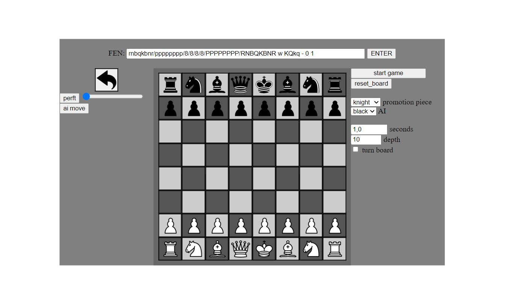

### Features

- up to depth 64 and 10 seconds of search time;
- take back moves;
- start game or analyze position;
- auto fen string update or load custom fen string ;
- Compatible with all major browsers (IE8+);
- Runs offline too;
- no ui freeze during the search;

# ChessEngine JS
link to play: https://omerbilget.github.io/JS-Chess-Engine-with-Gui/

